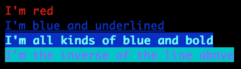

# gcolors
David W Millar <david.w.millar@gmail.com>
:compact-option:

image:https://travis-ci.org/david-w-millar/gcolors.svg["Build Status", link="https://travis-ci.org/david-w-millar/gcolors.svg"]
image:http://img.shields.io/maven-central/v/org.millarts/gcolors.svg["Maven Coordinates"]

Lightweight groovy extension module that provides ansi colors and styles to strings in supported terminals.

For more rigorous terminal acrobatics, checkout the awesome https://github.com/fusesource/jansi[jansi] project.

## Installation

Include this in your classpath. Groovy does the rest.

[NOTE]
Requires groovy 2.0 or later.

.Gradle and Grails
[source, groovy]
compile 'org.millarts:gcolors:0.2.0'

.Groovy Grape
[source, groovy]
@Grapes(
  @Grab(group='org.millarts', module='gcolors', version='0.2.0')
)

.Maven
[source, xml]
<dependency>
  <groupId>org.millarts</groupId>
  <artifactId>gcolors</artifactId>
  <version>0.2.0</version>
</dependency>

## Usage

.Example Usage
[source, groovy]
----
println "red".red()
println 'blue and underlined'.blue().underline()
println "I'm all kinds of blue and bold".cyan().bgBlue().bold()
println "I'm the inverse of the line above".cyan().bgBlue().bold().inverse()
----

This module attempts to determine if a terminal is capable of color.
If not, it will not add any ansi escape characters to the string.

## Color and Style Support

.Colors
- black
- red
- green
- yellow
- blue
- magenta
- cyan
- white
- gray
- grey

.Background Colors
- bgBlack
- bgRed
- bgGreen
- bgYellow
- bgBlue
- bgMagenta
- bgCyan
- bgWhite

.Styles
- bold
- dim
- italic
- underline
- inverse
- hidden
- strikethrough

### License

This project is licensed under the terms of the
http://www.apache.org/licenses/LICENSE-2.0.html[Apache License, Version 2.0].

&copy; 2015 David W Millar

// vim: set syntax=asciidoc:

